# Wie man OSAMD bauen kann: Eine kleine Anleitung :bulb:

In diesem Dokument wird gezeigt, wie man sich die Luftqualitätsmessstation selber bauen kann. Viel Spaß beim Bauen!

## Schritt 1: Vorbereitungen

Bevor mit dem Bauen begonnen wird, sollte sichergestellt werden, dass alle Teile und Werkzeuge zur Verfügung stehen.
Eine Materialliste (BOM, Bill of Materials) lässt sich [hier finden.](../1_Hardware/BOM.xlsx)
Werkzeuge, die benötigt werden:

 1. Lötkolben
 2. kleiner Seitenschneider
 3. Verbauchsmaterialien ((bleifreies) Lötzinn, Kabel und Entlötlitze sowie zwei M3 Gewindeschrauben mit mindestens 15 mm länge)
Sonst wird noch der Zugriff auf einen PC und auf einen 3D-Drucker benötigt. 3D-Drucker lassen sich vielen öffentlichen Makerspaces finden, der Druck des Gehäuses dauert rund 10 Stunden. Abstandshalter aus Messing helfen und sorgen dafür, dass die Teile immer im richtigen Platz bleiben.
Ein aufgeräumter Werktisch ist auch nur empfehlenswert.

## Schritt 2: 3D-Drucken!

Als erstes sollte der Druck des Gehäuses angestoßen werden, da dieser am längsten dauert. Unter [1_Hardware/Enclosure](../1_Hardware/Enclosure) finden sich die 3D-Modelldateien, die gedruckt werden sollten. 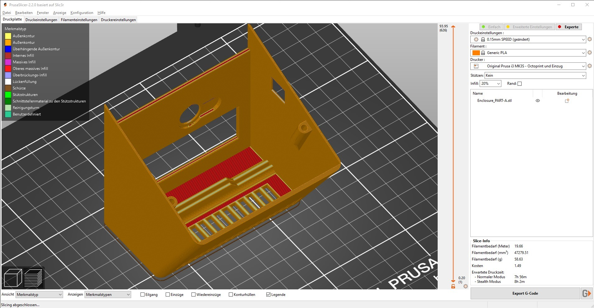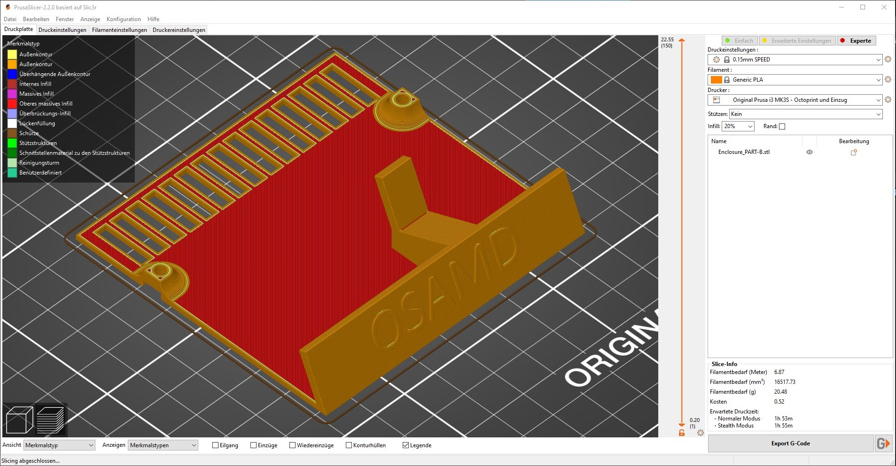Ich habe die Teile mit Mattweißen PLA und 150 μm Schichtdicke auf einem Prusa i3 MK3S gedruckt, beim Teil A empfiehlt es sich je nach Drucker supportmaterial hinzuzufügen.
Die Knopfverlängerung sollte auch jetzt schon gedruckt werden, die Druckzeit beträgt jedoch nur 5 Minuten.
Nachdem die Teile geruckt sind, geht es zum

## Schritt 3: Den Microcontroller vorbereiten :floppy_disk:

Als nächstes wird die Firmware auf den Microcontroller gespielt. Dafür wird der Arduino mit einem PC verbunden, auf dem die Arduino-IDE installiert ist. Dann kann nach öffnen des Sketches in der IDE und dem Auswählen des Seriellen Ports, an dem der Arduino angeschlossen ist, der richtige Chip ausgewählt werden. "Arduino Nano / Old Bootloader" empfiehlt sich hier, da die meisten Arduinos heutzutage noch den alten Bootloader verwenden (Optiboot ist der neue).
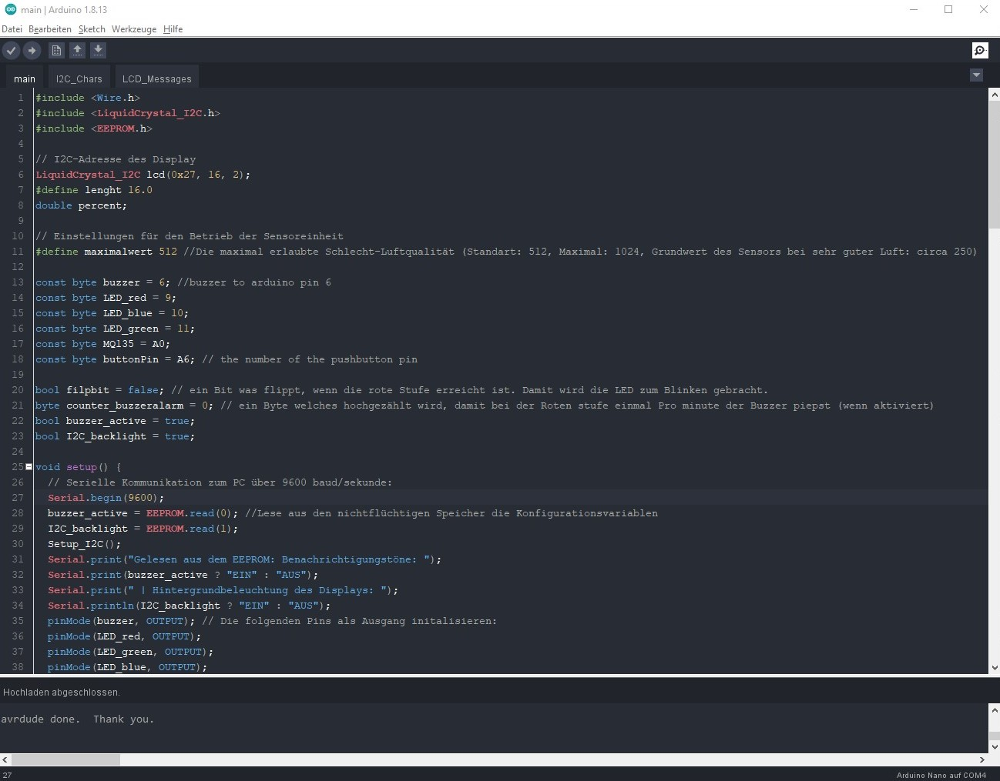Wenn die firmeware aufgespielt ist, kann der serielle Monitor (@9600 Baud) geöffnet werden. Hier sollte jetzt stehen, dass der Sensor aufheizt. Wenn das passiert, kann der Arduino abgezogen werden und es kann mit dem eigentlichen Zusammenbau los gehen.
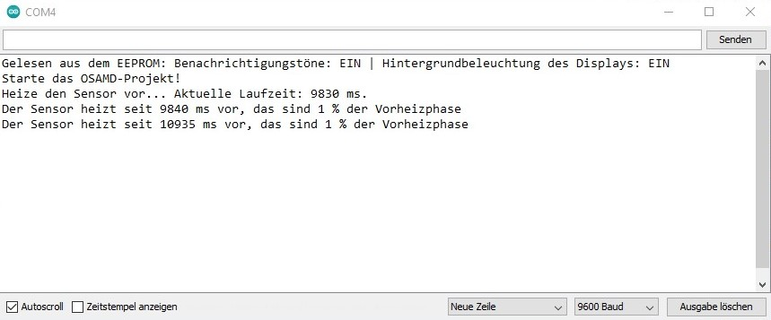

## Schritt 4: Das Löten

Nun kann es aber richtig lösgehen:
Erstmal die Widerstände in die Plätze setzen, dann diese einlöten. Die verbleibenden Litzen abschneiden, dann weiter den Schalter einlöten. Beim Arduino die Stiftleiten einlöten und auf das PCB löten (Wer nurmal sicher gehen will, kann einfach zwischen den Maleheader des Arduinos einen female-header setzen und so beim (unwahrscheinlichen) Kaputtgehen des Arduinos eine leichte austauschmöglichkeit schaffen.
Bevor das LCD-Panel und der Sensor eingelötet wird, muss noch der Kontrast vom LCD-Panel richtig eingestellt werden.
Nachdem noch der Buzzer eingelötet wurde, kann zu den beiden Submodulen gegangen werden: Bei diesen erst die voreingebauten Stiftleisten um 90 Grad drehen, sodass diese in die Vorrichtung auf dem PCB passen. Dann die Messing-Spacer in die Löcher stecken, die Module festschrauben und zu guter letzt die Verbindungen löten. So sieht das Mainboard dann aus:
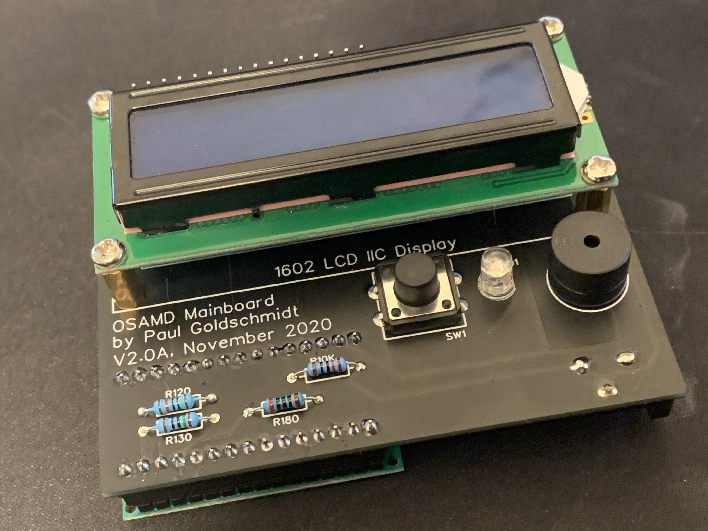
Und die Unterseite (auf dem Bild ist noch ein rotes Jumperkabel zu sehen, dieses ist in der aktuellen Hardwareversion nicht mehr benötigt):
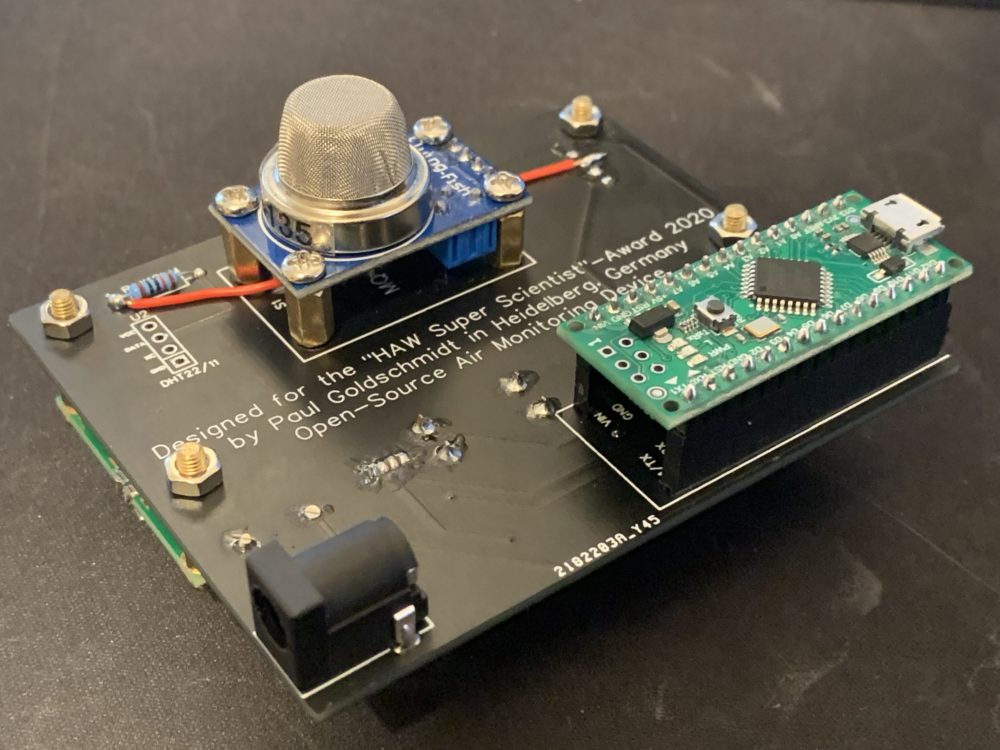
Bevor nun das Projekt zusammengeschraubt wird, kann dem gesamten Aufbau ein erster Funktionstest unterzogen werden. Dafür einfach das Stromkabel einstecken und auf der anderen Seite in ein USB-Netzteil stecken, dann sollte das folgende passieren:
Das LCD-Panel geht an, die LED leuchtet grün, blau und dann weiß, bevor sie rot wird und auf dem LCD-Display "Vorwärmen" steht.
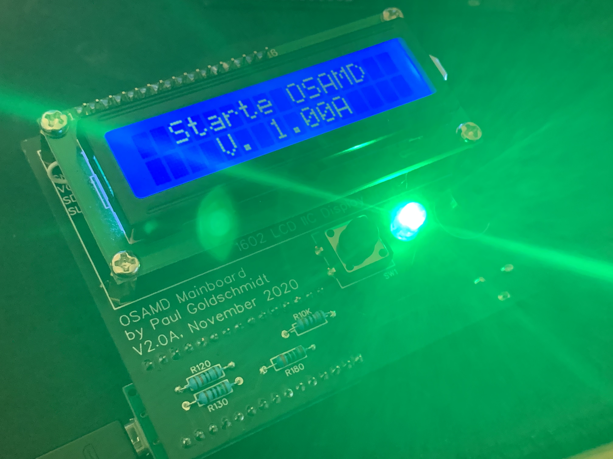
Wenn das alles passt, kann der Zusammenbau beginnen.

## Schritt 5: Der finale Zusammenbau

So, da jetzt alles funktioniert, kann das Projekt endlich zusammengebaut werden. Als erstes wird der Knopf mit der 3D-Gedruckten Verlängerung ausgestattet:
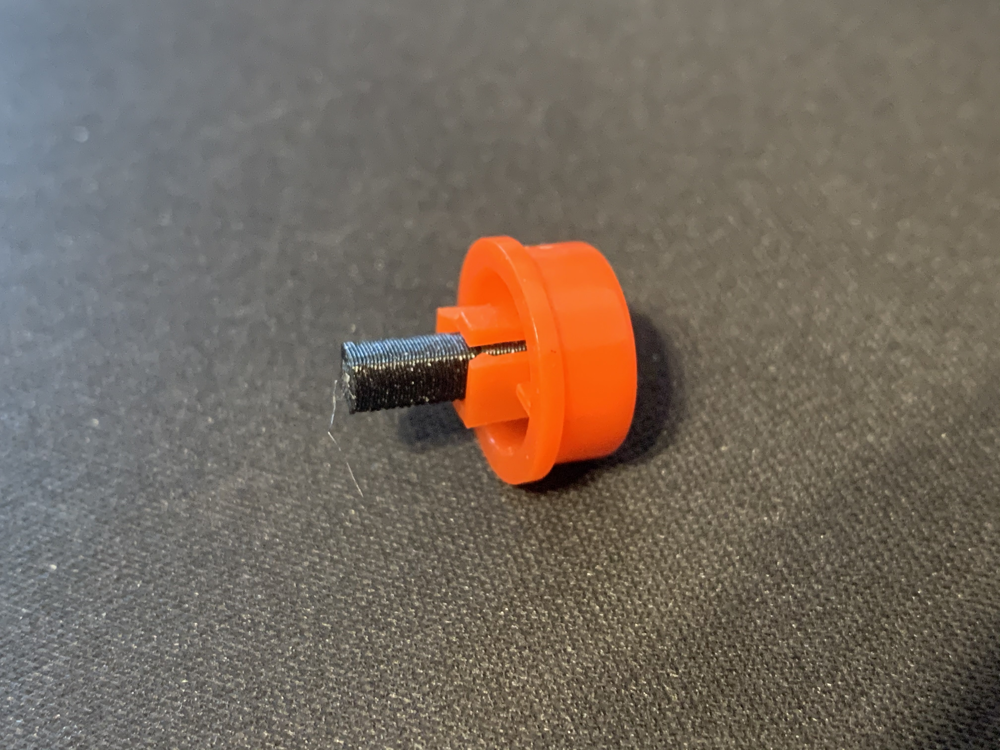
Als nächstes wird der Knopf in das Gehäuse gesteckt, dann wird das PCB in den Slot oben im Gehäuse geschoben, sodass das dann so aussieht:
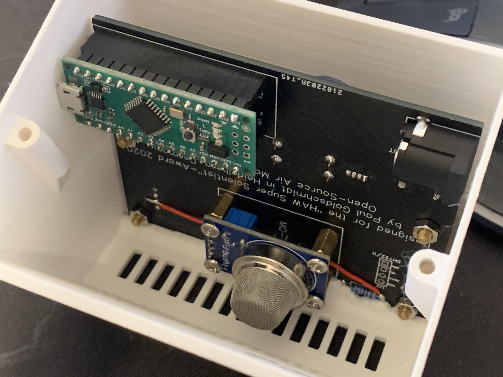
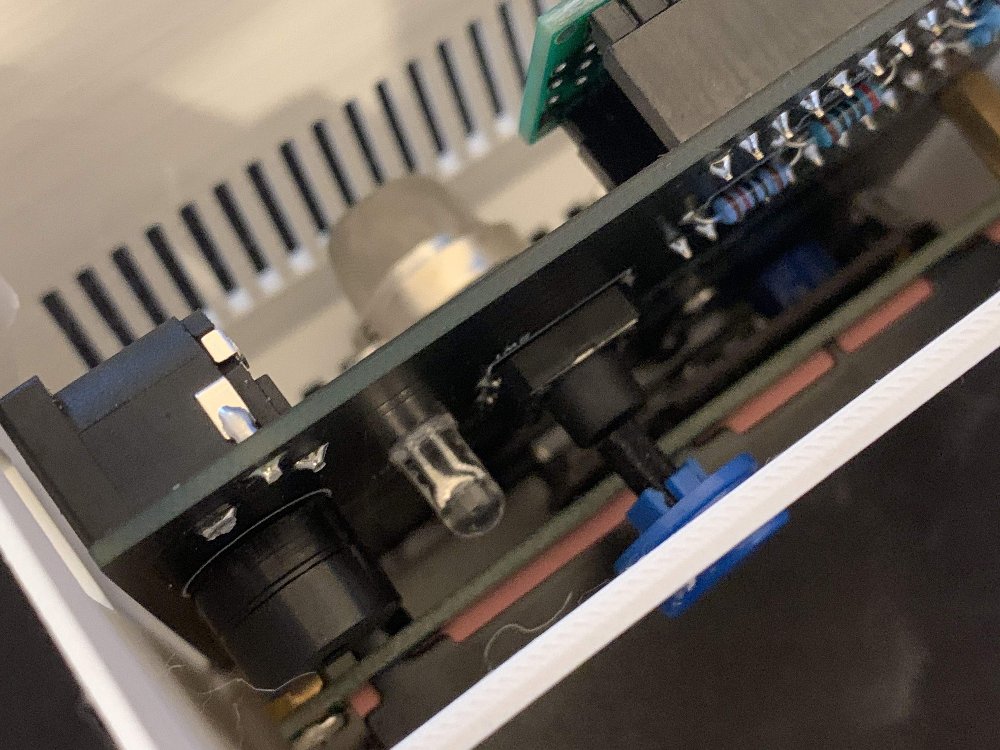
Dann kann die Unterseite auch in das Gehäuse geschoben werden:
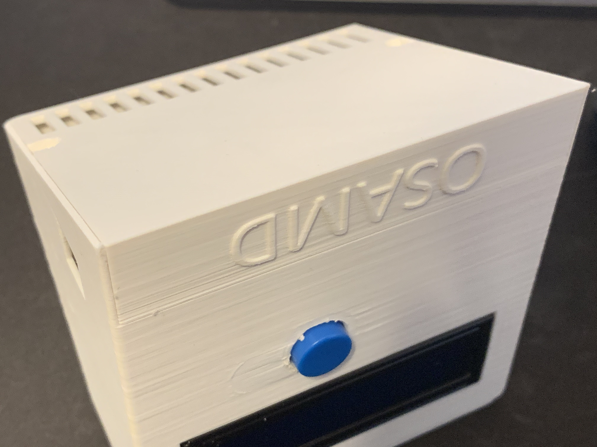
Als nächstes wird dass alles verschraubt:
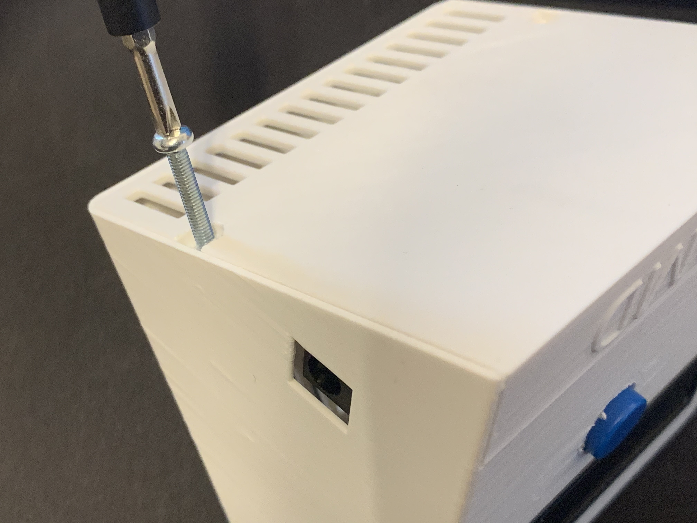
Dann sieht das von unten so aus:
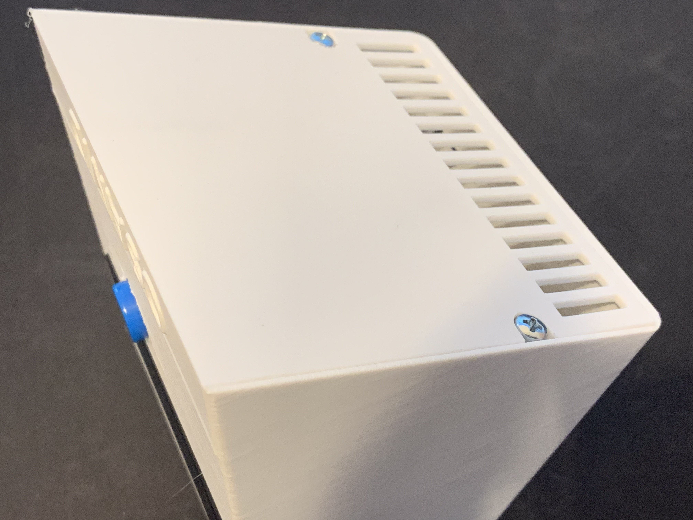
Damit Luft von unten rein kann und das Gehäuse gut steht, werden kleine Füße an das Gehäuse geklebt (und auch über die Schrauben)
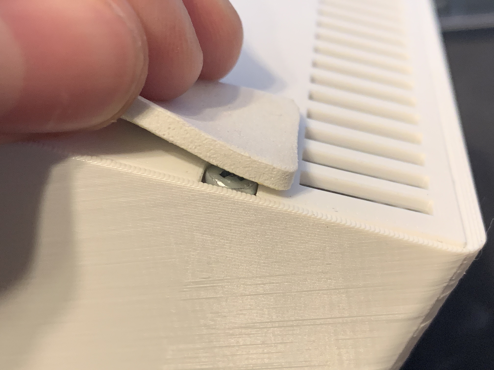
Mit allen Füßen sieht dass dann so aus:
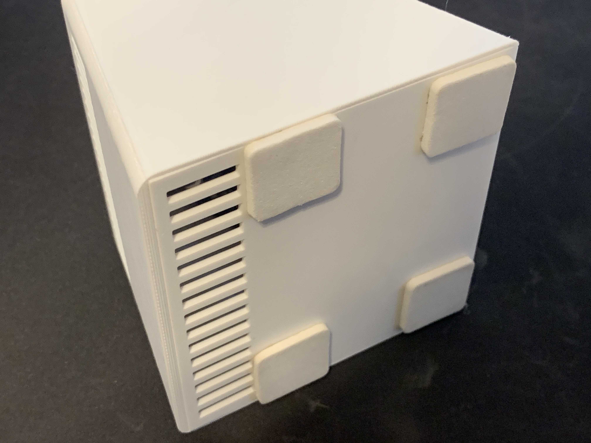
Dann kann das Projekt eingesteckt werden, und sollte alles wie gewünscht Funktionieren: **Herzlichen Glückwunsch! :tada:**
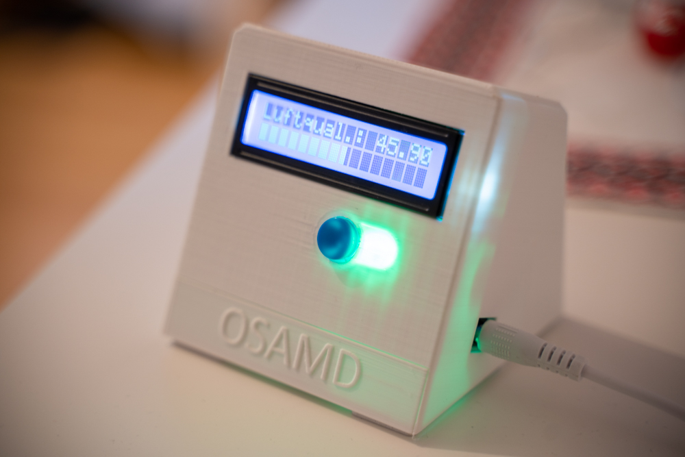
